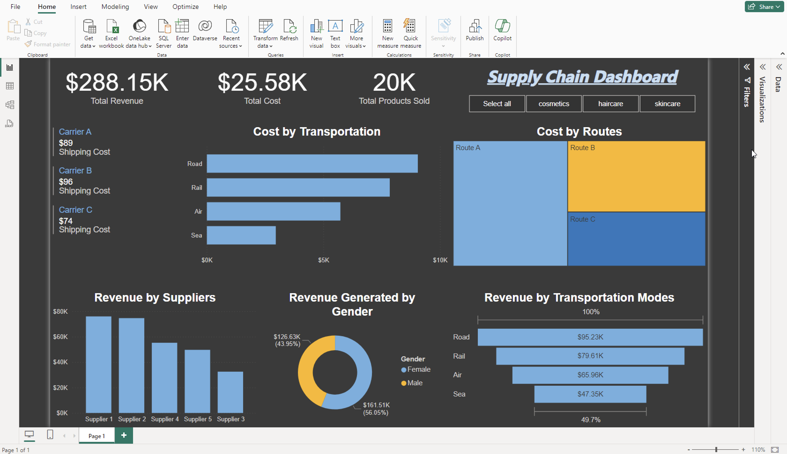

# SupplyChain-Dashboard
Supply chain data analysis and dashboard with PowerBI

This repository contains a PowerBI project and the corresponding data file for visualizing supply chain data.

## Screenshot 📷

## Files
- SupplyChainDashboard_Project.pbix: The PowerBI project file.
- supply_chain_data.csv: The data file used in the PoweBI project.

## How to Use
1. Open SupplyChainDashboard_Project.pbix in PowerBI.
2. Ensure the data source is connected to supply_chain_data.csv.
3. Explore the dashboards and visualizations.
